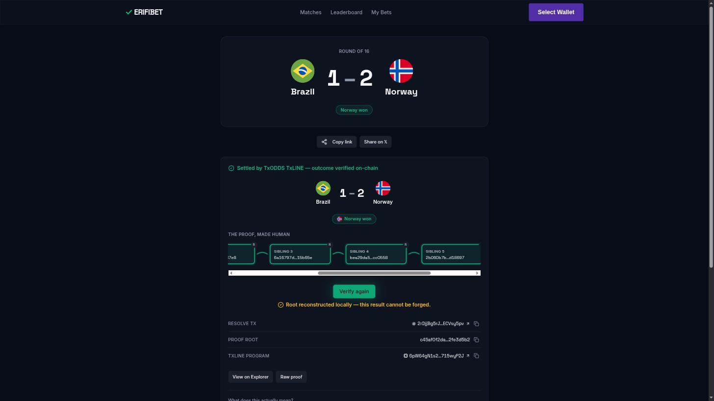

<p align="center">
  
</p>

# VERIFIBET

A Solana parimutuel prediction market for the 2026 World Cup, settled
against [TxODDS](https://txodds.com)'s on-chain data feed (TxLINE) instead
of an oracle any single party controls.

[](https://github.com/SamarthShukla17/verifibet/actions/workflows/anchor.yml)
[](https://explorer.solana.com/address/CCrrc5cdohor1EGGFkrQ3yKUS3zU9tnU2uzxWRnd2PMw?cluster=devnet)
[](https://verifibet.vercel.app)
[](LICENSE)

**Quick links:** [Live app](https://verifibet.vercel.app) ·
[Demo GIF](demo-assets/phase5-exit-connect-browse-bet-portfolio-share.gif) ·
[Example receipt](https://verifibet.vercel.app/receipts/18187298) ·
[Architecture](docs/ARCHITECTURE.md)

## The core loop


Connect → browse a match → place a bet → keeper logic runs the full
lock → resolve → void path against TxLINE autonomously — currently
triggered by an operator rather than a hosted daemon (see Feature 6 below)
→ claim → verified, shareable receipt. `DEMO_RUNBOOK.md` is the exact
rehearsed click path this was recorded from.

> This is the real recorded take from the project's "Phase 5 exit"
> session (~32s), not a fresh `gifski`-from-video export — this session
> had no raw screen-capture footage and no `gifski` binary or network
> access to install one, so the most complete existing recording was
> reused rather than fabricated. See `DEMO_RUNBOOK.md` to record a fresh
> one (`mcp__claude-in-chrome__gif_creator` or any screen recorder, target
> ≤2 minutes, export to `demo-assets/`).

## Features

1. **Settlement is provably honest, not just promised.** `resolve_market`
   cannot mark a market `Resolved` unless a real Merkle-proof CPI into
   TxLINE's own `validate_stat` returns `Ok(())` first — there is no code
   path that skips it. Every receipt ships the proof chain and a
   **"Verify in your browser"** button that recomputes the Merkle root
   client-side against TxLINE's published data. See
   [`docs/ARCHITECTURE.md`](docs/ARCHITECTURE.md) §2 and §7.
2. **Parimutuel markets, no house edge.** Group stage is a plain 1X2;
   knockout markets are two-outcome ("who advances," penalties included —
   a knockout match never really draws). Payout is exactly
   `stake * total_pool / winning_pool`, floored — every winning dollar
   gets its proportional share, nothing skimmed.
3. **Live odds and scores over SSE**, fed by TxLINE's real streams and
   fanned out to every connected browser through the app's own
   `/api/stream` route.
4. **Public, shareable settlement receipts** at `/receipts/<fixtureId>` —
   real final score, real resolve transaction, real Merkle proof, no
   login required to view one.
5. **Non-custodial escrow.** Each market's vault is the canonical
   associated token account of its own `Market` PDA — there is no admin
   sweep instruction and no way to redirect funds to a different account.
6. **Keeper logic runs the full lock → resolve → void path
   autonomously**, once triggered — polls TxLINE, locks markets at
   kickoff, resolves them at full-time via the real Merkle-proof CPI, and
   voids abandoned fixtures. A hosted daemon was scoped out pre-launch;
   today it's triggered by an operator (`pnpm keeper:resolve --fixture
   <id>`), not a background process — see
   [`docs/ARCHITECTURE.md`](docs/ARCHITECTURE.md) §1/§7.
7. **Devnet by design, mainnet by config flip.** Same program, same CPI,
   same PDA layout — going to mainnet is swapping `NEXT_PUBLIC_CLUSTER`
   and a mint address, not a rewrite (see "Devnet, by design" below).

## Local setup

Verified end-to-end in a genuinely fresh `git clone` while writing this
README — every command below actually ran, in order, on a clean checkout.

```bash
git clone https://github.com/SamarthShukla17/verifibet.git
cd verifibet
pnpm install
cp .env.local.example .env.local   # fill in TXLINE_*, KEEPER_SECRET_KEY, UPSTASH_*, ...
pnpm dev                           # http://localhost:3000
```

`pnpm dev` boots clean and serves real TxLINE data with no further setup
(confirmed: `/matches` and `/api/healthz` both 200, fixtures hydrated from
the live feed).

### Anchor program tests

```bash
cd anchor
pnpm install          # anchor/ has its own package.json — it is NOT a pnpm
                       # workspace member of the repo root, so the root
                       # `pnpm install` above never touches it
./scripts/test-local.sh
```

This is the command that's actually verified to work, and it's
deliberately **not** `anchor test` on its own — two real reasons, both
also documented in `CLAUDE.md`:

- Plain `anchor test` on a fresh clone fails immediately with
  `Command "ts-mocha" not found`, because of the separate-package issue
  above.
- Even with that fixed, a bare `anchor test` is unsafe as written:
  `Anchor.toml`'s `[provider] cluster = "Devnet"` means `anchor test`
  without `--provider.cluster localnet` skips the local validator and
  tries to deploy straight to real devnet.

`./scripts/test-local.sh` builds both programs (`verifibet` with
`--features test-mock-txline`, so `resolve_market`'s CPI targets a local
mock instead of real TxLINE) and runs the suite against a local validator.
Verified output on a fresh clone:

```
  verifibet
    initialize_market
      ✔ init happy: all fields set, vault ATA owned by the market PDA
      ✔ init past kickoff fails with KickoffPassed
    place_bet
      ✔ two users x two outcomes: pools and vault balance are exact
      ✔ re-betting the same outcome accumulates into the same Bet PDA
      ✔ outcome 3 fails with InvalidOutcome
      ✔ a token account for the wrong mint fails with MintMismatch
      ✔ betting after kickoff fails with KickoffPassed
    resolve_market guards
      ✔ resolve by a non-authority signer fails with Unauthorized
      ✔ resolve before kickoff fails with KickoffNotPassed
    resolve + claim lifecycle
      ✔ resolving with a forced mock-CPI failure reverts and leaves the market unresolved
      ✔ resolves happily via the mock CPI
      ✔ winner claim pays out the exact BigInt-computed share
      ✔ double claim fails with AlreadyClaimed
      ✔ a losing bet fails to claim with NotWinningBet
      ✔ claim_refund on a Resolved (never voided) market fails with MarketNotVoided
    void + refund lifecycle
      ✔ voiding before the grace window elapses fails with TooEarlyToVoid
      ✔ claim_refund before the market is voided (still Open) fails with MarketNotVoided
      ✔ void + refund returns every bettor's exact stake
      ✔ double refund fails with AlreadyClaimed
      ✔ claim_winnings on a Voided market fails with MarketNotResolved
    conservation
      ✔ after every winner claims, the vault holds less than one unit of dust per winner
      ✔ void + refund: 3 users x 2 outcomes drains the vault to exactly 0, no dust

  22 passing (44s)
```

Needs `anchor-cli` 0.30.1, `solana-cli` 1.18.x, and the `v1.52`
platform-tools toolchain already on `PATH` — see `CLAUDE.md`'s "Known
toolchain issue" section if `anchor build`'s own IDL step ever needs
touching directly; `test-local.sh` already routes around it.

## Reproduce the demo environment

Populate a live, walkable demo of the deployed program with one command —
real markets, real varied bets, real settled receipts:

```bash
cp .env.local.example .env.local   # fill in KEEPER_SECRET_KEY, TXLINE_*, etc.
pnpm install
pnpm seed:demo
```

`scripts/seed-demo.ts` (idempotent — safe to re-run):

1. Creates five on-chain markets in a reserved demo fixture-id range, one
   per demo scenario (`pens`, `qf-thriller`, `underdog`, `late-drama`,
   `final-preview` — see `demo-data/scenarios/`).
2. Places ~20 varied bets from three deterministic, publicly re-derivable
   devnet wallets, so the leaderboard has real, distinguishable activity.
3. Resolves two **real** fixtures (not demo-range ones — `resolve_market`'s
   CPI only ever succeeds against TxLINE's genuine on-chain data) through
   the same backfill path `pnpm keeper:resolve --fixture <id>` uses, so
   `/portfolio` and `/receipts/<fixtureId>` have real, Merkle-verified
   settled content.
4. Leaves exactly one unclaimed winning bet on the presenter/dev wallet.
   `pnpm reset:demo` re-arms it between takes.

Two known, deliberate gaps (both confirmed live, documented in
`scripts/seed-demo.ts`'s own doc comment): `pens`'s real fixture (Germany
v Paraguay) is permanently unresolvable through the real CPI — it was
decided on penalties, and the CPI only ever proves an FT+ET goal
difference, with no on-chain representation of a shootout at all; its
market stays `Open` rather than being resolved dishonestly.
`late-drama`'s real fixture hits a reproducible TxLINE-side devnet
`TimestampMismatch`, outside this program's control.

To record a live, on-camera take of the full click path (place a bet →
kickoff → goal → full-time → auto-resolve → claim → receipt), see
`DEMO_RUNBOOK.md`.

## Stack

- **Frontend** — Next.js 14 (App Router), React 18, Tailwind CSS +
  Radix-based primitives, Framer Motion, next-themes
- **Chain** — Anchor 0.30.1 on Solana (devnet), `@solana/web3.js`,
  `@solana/spl-token`, wallet-adapter (Phantom, Solflare)
- **Data** — TxLINE (TxODDS) REST + SSE, Zod-validated at every boundary
- **Infra** — Vercel (app + `app/api/*` TxLINE proxy), Upstash Redis
  (response caching + keeper coordination), pino (structured logs),
  Telegram alerts on keeper failure
- **Testing** — Vitest (TypeScript), Anchor's mocha/chai harness (Rust
  program, 22 tests), `tsx` for CLI scripts

## Devnet, by design

Two independent reasons for staying on devnet, either sufficient alone:
**cost** (this program's `Market`/`Bet` PDA rent is real, non-refundable
SOL for a project that doesn't need to hold real value yet), and
**regulatory** (built solo from India, where real-money online gaming is
heavily restricted — devnet sidesteps that question entirely rather than
relying on a legal read of a gray area). Neither reason caps the
architecture: `lib/config.ts` already carries TxLINE's real mainnet
addresses side-by-side with the devnet ones this deploy uses — flipping
`NEXT_PUBLIC_CLUSTER`, deploying `verifibet` to mainnet, and pointing at
real USDC is the entire migration.

## TxLINE integration

Built **solo**. What TxLINE actually powers, end to end — not just "integrated with," but
the specific surfaces this program depends on for every real feature (full
detail + file locations in
[`docs/ARCHITECTURE.md`](docs/ARCHITECTURE.md) §3):

| TxLINE surface | What it powers here |
|---|---|
| **Fixtures** (`/api/fixtures/snapshot`) | Tournament schedule — every market this app can create |
| **Odds** (`/api/odds/snapshot/{fixtureId}`) | Live pricing on the bet slip |
| **Scores** (`/api/scores/snapshot/{fixtureId}`) | The keeper's finality signal — when a fixture is stably `FINISHED` |
| **Proofs** (`/api/scores/stat-validation`) | The 3-level Merkle proof material `resolve_market`'s CPI needs |
| **CPI** (`validate_stat`, called from `resolve_market`) | The *only* way a market can ever be marked `Resolved` — see §2/§7 |
| **Stream** (`odds/stream`, `scores/stream`, SSE) | Live odds ticks and score/status updates in the UI |

No mock settlement path ships in the default build — `resolve_market`
either gets a real TxLINE-verified proof or the market stays unresolved.

## License

[MIT](LICENSE)
