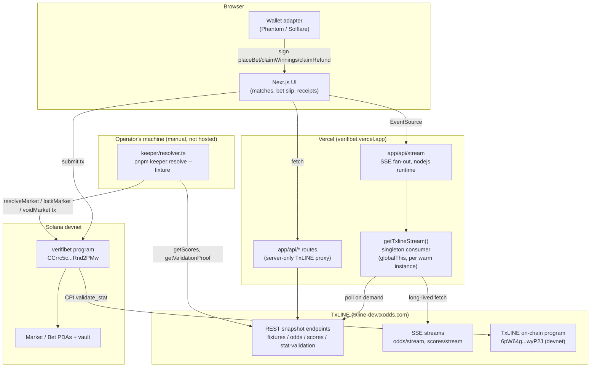

# VERIFIBET architecture

A 3-minute skim of the system. VERIFIBET is a Solana parimutuel prediction
market for the 2026 World Cup, settled against TxODDS's on-chain data feed
(TxLINE) rather than an oracle any single party controls.

## 1. System overview

Deployed topology as of 2026-07-26 (`NOTES.md`'s "deploy" entry) — there is
**no hosted worker**. A Railway daemon (`keeper/index.ts`) was the original
plan but was explicitly cut before the deadline; resolution instead runs
from an operator's own machine via a manual CLI backfill
(`pnpm keeper:resolve --fixture <id>`). The diagram below reflects what's
actually live, not the original plan.



Two independent halves that only meet inside the on-chain program:

- **Read/display path**: browser to Vercel's `app/api/*` (REST proxy, keeps
  `TXLINE_JWT`/`TXLINE_API_TOKEN` server-only) and `app/api/stream` (SSE),
  which both ultimately read TxLINE's off-chain API. Informational only —
  nothing here can move money or resolve a market.
- **Money path**: browser wallet signs `place_bet`/`claim_winnings`/
  `claim_refund` directly against the `verifibet` program on devnet. The
  frontend never custodies funds or decides outcomes.
- **Settlement path**: the keeper (run manually, not hosted) reads TxLINE's
  REST API for scores + Merkle proof material and submits
  `resolve_market`, which CPIs into TxLINE's own `validate_stat` on-chain.
  This is the only path that can mark a market `Resolved`.

## 2. Resolve CPI sequence

`resolve_market` (`anchor/programs/verifibet/src/instructions/resolve_market.rs`)
is unreachable from `Resolved` unless TxLINE's `validate_stat` CPI returns
`Ok(())` — there is no other code path that sets `market.status = Resolved`.

```mermaid
sequenceDiagram
    participant K as keeper (resolver.ts)
    participant T as TxLINE REST API
    participant V as verifibet::resolve_market
    participant X as TxLINE::validate_stat (CPI)

    K->>T: GET /api/scores/snapshot/{fixtureId}<br/>(poll until 2x consecutive FINISHED)
    K->>K: deriveOutcome(scoreEvent, stage)<br/>(group: FT 1X2; knockout: FT+ET, then pens)
    K->>T: GET /api/scores/stat-validation<br/>fixtureId, seq, statKey=1, statKey2=2
    T-->>K: fixture_summary, fixture_proof,<br/>main_tree_proof, stat_home, stat_away
    K->>K: cross-check: proof-implied outcome<br/>must equal deriveOutcome's outcome<br/>(else CpiValidationFailureError, never overridden)
    K->>V: resolve_market(outcome, ts,<br/>fixture_summary, fixture_proof, main_tree_proof,<br/>stat_home, stat_away)
    Note over V: guards: status Open/Locked,<br/>kickoff passed, outcome must be 0/1/2,<br/>both stats period==100 (full-time)
    V->>X: CPI validate_stat(ts, fixture_summary,<br/>fixture_proof, main_tree_proof,<br/>predicate(outcome), stat_home,<br/>Some(stat_away), Some(Subtract))
    X->>X: verify 3-level Merkle proof against<br/>daily_scores_merkle_roots PDA (TxLINE's own root)
    alt proof valid
        X-->>V: Ok(())
        V->>V: market.status = Resolved<br/>market.outcome = outcome<br/>market.proof_hash = sha256(fixture_id‖outcome‖<br/>home_value‖away_value‖events_sub_tree_root)
        V-->>K: emit MarketResolved
    else proof invalid
        X-->>V: Err (reverts whole tx)
        V-->>K: InvalidStatProof (market untouched)
    end
```

**Account list for `resolve_market`** (`ResolveMarket` in `resolve_market.rs`):

| Account | Type | Role |
|---|---|---|
| `authority` | `Signer` | Must equal `market.authority` (the keeper wallet) |
| `market` | `Account<Market>`, mut | Re-derived from `[MARKET_SEED, fixture_id]`, not trusted as passed |
| `txline_program` | `Program<Txoracle>` | Pinned at compile time to TxLINE's real program ID — no substitute possible |
| `daily_scores_merkle_roots` | `UncheckedAccount` | Re-derived `["daily_scores_roots", epoch_day(ts)]` under `txline_program`, so a mismatched-day account can't even reach the CPI |

## 3. TxLINE surface — every endpoint/stream/instruction actually used

| Surface | Used from | Purpose |
|---|---|---|
| `GET /api/fixtures/snapshot?competitionId=&startEpochDay=` | `lib/txline/client.ts` (`getFixtures`/`getFixturesResilient`) — read by `app/api/fixtures/route.ts`, `scripts/sync-markets.ts` | Tournament fixture list, market seeding |
| `GET /api/odds/snapshot/{fixtureId}` | `lib/txline/client.ts` (`getOdds`) | Latest decimal odds for the bet slip |
| `GET /api/scores/snapshot/{fixtureId}` | `lib/txline/client.ts` (`getScores`) — polled by `keeper/resolver.ts`'s `pollUntilStableFinished` | Live score/action events; the finality signal for resolution |
| `GET /api/scores/stat-validation?fixtureId&seq&statKey&statKey2` | `lib/txline/client.ts` (`getValidationProof`), wrapped by `lib/txline/proofs.ts` (`fetchProof`) — called from `keeper/resolver.ts` | 3-level Merkle proof material for the `validate_stat` CPI |
| `GET /api/odds/stream` (SSE) | `lib/txline/stream.ts` (`NetworkSource`, `TxlineStreamManager`) | Live odds ticks, fanned out via `app/api/stream/route.ts` |
| `GET /api/scores/stream` (SSE) | `lib/txline/stream.ts` (`NetworkSource`, `TxlineStreamManager`) | Live score/status ticks, same fan-out |
| `subscribe(serviceLevelId, weeks)` (TxLINE on-chain instruction) | `scripts/txline-subscribe.ts` | One-time devnet subscription to Service Level 1 (World Cup + friendlies), free tier |
| `validate_stat` (TxLINE on-chain instruction, CPI) | `anchor/programs/verifibet/src/instructions/resolve_market.rs` | The only thing that can make `resolve_market` succeed — see §2 |

## 4. Parimutuel math

No house edge, no protocol fee. Every winning dollar staked gets exactly
its proportional share of the total pool (`claim_winnings.rs`):

```
payout(bet) = floor( bet.amount * market.total_pool / market.pools[winning_outcome] )
```

Computed with a `u128` intermediate (`amount * total` can exceed `u64::MAX`
even though the final payout always fits back in a `u64`), and against the
pool totals **frozen at `resolve_market`** — not decremented per claim, so
payout never depends on claim order.

**Worked example.** Home/Draw/Away pools end at 600 / 150 / 250 USDC
(total 1,000 USDC), home wins:

- A bettor who staked 100 USDC on Home gets
  `100 * 1000 / 600 = 166.666...` → **166.666666 USDC** (floored to the
  base unit, 6dp) — a ~1.67x return.
- A bettor who staked 50 USDC on Draw or Away gets **0** — losing outcomes
  pay nothing back.
- Summed across every Home bettor, payouts total at most 1,000 USDC, never
  more; the flooring remainder (at most `pools[home] - 1` base units,
  typically a handful of micro-USDC) is unclaimed dust that stays in the
  vault permanently — see §6.

## 5. PDA / account table

Seeds are defined once in Rust (`anchor/programs/verifibet/src/state.rs`)
and mirrored byte-for-byte in TS (`lib/solana/pda.ts`) — no other call site
re-derives them.

| Account | Seeds | Notes |
|---|---|---|
| `Market` | `["market", fixture_id.to_le_bytes()]` | One per TxLINE fixture; deterministic from fixture id alone |
| `Bet` | `["bet", market, user, [outcome]]` | One position per `(user, outcome)` pair, not per bet — re-betting the same outcome accumulates into `amount`; a different outcome opens a distinct PDA |
| Escrow vault | *(not a custom PDA)* | Always the canonical associated token account of `market` for `usdc_mint` — enforced via `associated_token::authority = market` constraints everywhere it's touched, closing vault-substitution off by construction |
| TxLINE `daily_scores_merkle_roots` | `["daily_scores_roots", epoch_day(ts) LE u16]` under `txline_program` | Re-derived by `resolve_market`, not trusted as a passed account |

`Market` also stores `authority`, `usdc_mint`, `home`/`away` (max 24 bytes
each), `kickoff_ts`, `status` (Open/Locked/Resolved/Voided), `outcome`
(0/1/2, or `255` = unset), `pools: [u64; 3]`, `total_pool`, `proof_hash`
(32 bytes), `resolved_at`.

## 6. Kickoff (KO) semantics

- **Betting window**: `place_bet` requires
  `Clock::get()?.unix_timestamp < market.kickoff_ts`, enforced on-chain on
  every call — a bet submitted right before kickoff but confirmed after it
  is rejected, not silently accepted.
- **Locking**: `lock_market` (keeper-only, `authority` signer) flips
  `Open → Locked` once TxLINE reports the fixture `LIVE`. Betting is
  blocked by the kickoff-timestamp check regardless of whether `lock_market`
  has actually landed yet — locking is a UX/bookkeeping signal, not the
  only enforcement.
- **Resolution eligibility**: `resolve_market` additionally requires
  `Clock::get()?.unix_timestamp > market.kickoff_ts` and accepts a market
  in either `Open` or `Locked` status — a market that never got explicitly
  locked can still resolve directly.
- **Outcome derivation** (`lib/txline/normalize.ts`'s `deriveOutcome`, the
  *only* place any outcome is computed in this app):
  - **Group stage**: plain FT 1X2 comparison of `ScoreEvent.home`/`away`.
  - **Knockout** (R32/R16/QF/SF/THIRD/FINAL): never draws. Compares FT+ET
    goals first; only falls back to `homePens`/`awayPens` when those are
    tied. Reverse-engineered from a real fixture (Germany v Paraguay,
    R32, `18175983`) since TxLINE's own docs don't spell out the
    penalty-shootout encoding.
  - **On-chain gap**: `resolve_market`'s CPI only ever proves an FT+ET goal
    *difference* — there is no on-chain representation of a shootout
    score. If `deriveOutcome` picked a winner on penalties, the proof's
    own implied outcome is always "draw," so the keeper's own cross-check
    (`resolver.ts`) catches the mismatch and refuses to submit rather than
    submitting a claim it can't back on-chain. See §7.
- **Void path**: `void_market` requires
  `unix_timestamp > kickoff_ts + 86,400` (one day) on top of the usual
  status guard — an authority cannot void a market that's simply still
  in-flight to dodge an unfavorable resolution.

## 7. Honest limitations

- **SL1's "60-second delay" does not apply here.** TxODDS's own marketing
  describes a 60-second sampling interval for the free Service Level 1
  tier — but that's a **mainnet** characteristic. This deployment is
  devnet, and devnet's own on-chain `pricing_matrix` reports
  `samplingIntervalSec: 0` for SL1, confirmed by reading the account
  directly, not assumed from docs (`CLAUDE.md`, `lib/txline/client.ts`).
  A mainnet deployment would need to budget for that delay; this one
  doesn't have it.
- **Devnet only.** Program ID, TxLINE program ID, and USDC mint are all
  devnet addresses (`CLAUDE.md`). No mainnet deployment exists.
- **No hosted keeper.** As of the 2026-07-26 deploy there is no Railway/Fly
  worker running `keeper/index.ts`'s reconcile loop in production —
  resolution runs from an operator's machine via
  `pnpm keeper:resolve --fixture <id>` (`NOTES.md`'s "deploy" entry). The
  daemon code exists and is tested, but nothing keeps it running
  unattended today. `/api/keeper/status` correctly reports the keeper
  offline in production rather than faking liveness.
- **Dust rounding.** `claim_winnings`' floor division means the sum of all
  winning payouts can be slightly less than the winning pool's exact share
  of `total_pool` — at most `winning_pool - 1` base units of USDC (6dp)
  across every winner combined, typically far less. That remainder has no
  sweep instruction; it sits in the vault forever. Deliberate: a sweep
  would be its own attack surface (a path to drain funds from a bettor who
  simply hasn't claimed yet).
- **The keeper is permissioned but cannot lie about outcomes.** `market.authority`
  (the keeper wallet) is trusted to *call* `lock_market`/`resolve_market`/
  `void_market`, and it can pick *which* stat keys to submit as "home" and
  "away" (TxLINE's `ScoreStat.key` is opaque — nothing on-chain proves the
  keeper picked the semantically-correct keys, only that whatever keys it
  picked are backed by a real, Merkle-proven value). But it **cannot**
  submit a fabricated score: every value in `resolve_market`'s CPI is
  checked against TxLINE's own `daily_scores_merkle_roots`, a root TxLINE
  itself publishes and this program only reads, never writes. A keeper
  that tried to claim a false outcome would need a proof TxLINE's root
  doesn't support, and `validate_stat` would revert the whole transaction —
  `market` is provably untouched on any failed attempt (see §2). This is
  the right trust model for "permissioned but not trusted": the party that
  triggers settlement is not the party whose word settlement depends on.

## Reference: full instruction set

| Instruction | File | Guard summary |
|---|---|---|
| `initialize_market` | `instructions/initialize_market.rs` | Creates `Market` + vault; `kickoff_ts` must be future; team names ≤24 bytes |
| `place_bet` | `instructions/place_bet.rs` | `Open`, pre-kickoff, outcome must be 0/1/2, amount > 0; mint/vault pinned to `market.usdc_mint` |
| `lock_market` | `instructions/resolve_market.rs` | `Open → Locked` |
| `resolve_market` | `instructions/resolve_market.rs` | See §2 |
| `claim_winnings` | `instructions/claim_winnings.rs` | `Resolved`, bet matches winning outcome, not already claimed; state-then-interaction |
| `void_market` | `instructions/void_and_refund.rs` | `Open`/`Locked`, ≥1 day past kickoff |
| `claim_refund` | `instructions/void_and_refund.rs` | `Voided`, not already claimed; exact stake back, no proportional math |
| `resolve_market_attested` | `instructions/resolve_market.rs` | **Contingency only**, compiled out by default (`manual-fallback` feature) — bypasses the TxLINE CPI entirely and trusts `authority`'s word. Not part of the submission build; if ever used, must be disclosed per-market (see the instruction's own doc comment) |
